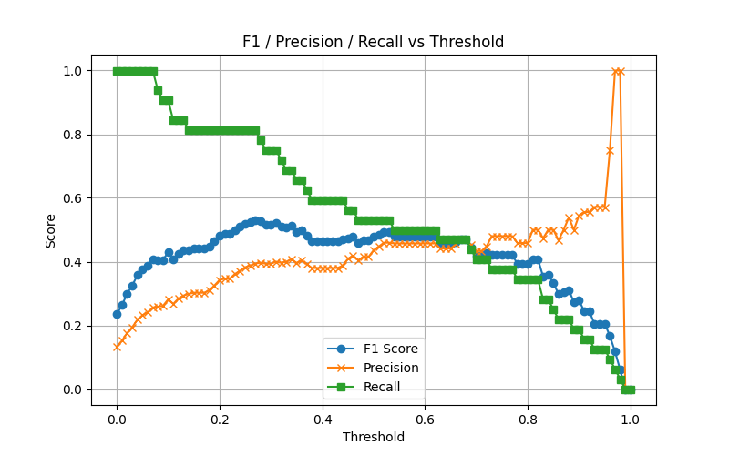
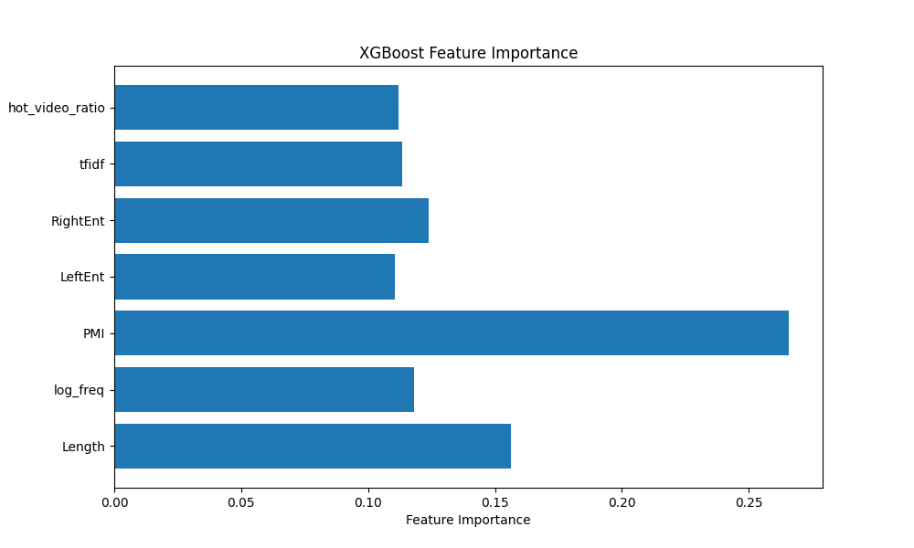

# Bilibili Comment Analysis & New Word Discovery System

A comprehensive system for collecting, analyzing, and discovering new words from Bilibili comments — powered by Playwright, XGBoost, and Flask for continuous model improvement.


## 🎥 Demo Video
*Demo video not yet uploaded — coming soon*


## ⚙️ Environment Setup

### Prerequisites
- Python 3.7+
- Chrome/Chromium browser
- SQLite (auto-created automatically)

## Installation Steps
### 1. Clone the repository
```
git clone https://github.com/Ray-gyr/Bilibili-New-Internet-Slang-Discovery-System.git
cd Bilibili-New-Internet-Slang-Discovery-System
```
### 2. Create and activate virtual environment
```
python -m venv venv
source venv/bin/activate      # On Windows: venv\Scripts\activate
```
### 3. Install Python dependencies
```
pip install -r requirements.txt
```
### 4. Install Playwright browser
```
playwright install chromium
```
## 🎯 Project Overview
This system automatically discovers emerging Chinese internet slang through a complete pipeline:

- Intelligent Data Collection - Multi-category balanced sampling from Bilibili

- Machine Learning Filtering - XGBoost model identifies potential slang

- Human-in-the-Loop Validation - Web-based collaborative annotation platform

- Quality Control - Administrator review and approval workflow

## 🕷️ Advanced Web Crawling System
Intelligent Multi-Category Crawler
Our crawler implements sophisticated strategies for comprehensive data collection from Bilibili:

### 1. Balanced Category Sampling
Proportional sampling across multiple content categories
```
CATEGORY_RATIOS = {
    'kichiku': 0.45,    # Kichiku/鬼畜区 - Memes and parody content
    'music': 0.10,      # Music/音乐区 - Music and performances  
    'game': 0.10,       # Gaming/游戏区 - Game streaming and reviews
    'life': 0.10,       # Lifestyle/生活区 - Daily life and vlogs
    'knowledge': 0.10,  # Knowledge/知识区 - Educational content
    'film': 0.10,       # Film/影视区 - Movies and TV shows
    'other': 0.05       # Other categories
}
```
### 2. Dynamic Sampling Strategy
The crawler automatically adjusts category sampling based on current database distribution to maintain linguistic diversity and prevent bias toward any single content type.

### 3. Anti-Detection Features
- WBI Signature Verification - Implements Bilibili's latest anti-crawler signature system

- Real Browser Automation - Uses Playwright with human-like interaction patterns

- Request Throttling - Intelligent delays between requests to avoid rate limiting

- Session Management - Maintains persistent login sessions with cookie refresh
  
## 🧠Model Training Summary
Existing Chinese word segmentation tools such as Jieba and pkuseg still struggle to accurately identify emerging Internet slang.
Therefore, this system is built from scratch to intelligently detect and evaluate newly coined expressions in online discourse.
### Feature Selection Strategy
Our feature engineering combines linguistic theory and statistical analysis to identify emerging slang patterns:

**Statistical Features**
- PMI - Measures internal character association strength

- Left/Right Entropy - Quantifies contextual boundary flexibility

- TF-IDF - Identifies distinctive terms across videos

- Log Frequency - Normalizes occurrence patterns

**Contextual Features**
- Word Length - Captures typical slang morphology (2-6 characters)

- Hot Video Ratio - Tracks viral propagation in trending content
---
### Training

The model was trained in two iterative phases, both validated using 5-fold cross-validation. Hyperparameter optimization was conducted via Optuna for the XGBoost model.

**Performance Comparison**
| Phase   | Samples | Accuracy | Recall | F1-score |
|---------|--------|---------|--------|----------|
| Phase 1 | 555    | 0.955   | 0.95   | 0.93     |
| Phase 2 | 1,205  | 0.851   | 0.72   | 0.70     |
---
### Phase 1 — Foundation Model (5-Fold Cross Validation)
- Training data consists of **555 obviously true / obviously false words** to establish a reliable baseline

**Performance Metrics (5-Fold Cross Validation**):

Accuracy: 0.9550
Classification Report:
```

              precision    recall  f1-score   support
           0       0.99      0.96      0.97        89
           1       0.84      0.95      0.89        22
    accuracy                           0.95       111
   macro avg       0.91      0.95      0.93       111
weighted avg       0.96      0.95      0.96       111

Confusion Matrix:
[[85  4]
[ 1 21]]
```
Due to the small size of the dataset, the words are easy to learn, so an accuracy of 0.9550 does not necessarily indicate that the model has sufficient generalization ability.
### Phase 2 — Enhanced Model (Extended Dataset)
- Phase 2 expands training data by using the **Phase 1 model to identify borderline candidates** with confidence around 0.5.  
- These uncertain words were **manually labeled** to enlarge the dataset to **1,205 samples**, improving generalization.

**Performance Metrics (5-Fold Cross Validation)**:

Accuracy: 0.8506
Classification Report:
   ```

	             precision    recall  f1-score   support
	          0       0.93      0.90      0.91       209
	          1       0.45      0.53      0.49        32
	   accuracy                           0.85       241
	  macro avg       0.69      0.72      0.70       241
weighted avg       0.86      0.85      0.86       241

Confusion Matrix:
[[188  21]
[ 15 17]]
```
After training, the base model’s accuracy dropped to 0.8506. However, considering that the newly learned data is more challenging, this is a reasonable decrease. 

**Optimized XGBoost Parameters (via Optuna)**
```
{
  "n_estimators": 71,
  "max_depth": 6,
  "learning_rate": 0.09006,
  "subsample": 0.60191,
  "colsample_bytree": 0.86900,
  "scale_pos_weight": 7.9461,
  "min_child_weight": 4
}
```
**Optimal Threshold Selection (0.27)**

The threshold of 0.27 represents a tradeoff between F1-score and Recall. Since the system prioritizes catching all potential slang words, higher recall is crucial, while maintaining a reasonable F1-score.




📊 Model Feature Importance



Despite improvements in generalization, the dataset size and manual labeling scope **remain limited**.
Future iterations could integrate semantic embeddings (e.g., from Chinese BERT or ERNIE) and temporal features to capture evolving slang more effectively.

## 🌐 Web Interface Overview
**Running the Website Locally**
```
$env:FLASK_APP = "Webapp.app.py"
$env:FLASK_ENV = "development"
flask run
```
**Main Interface**
- Trending Terms Cloud: Shows popular slang with frequency-based sizing

- Dictionary Search: Search validated slang entries

**Annotation Interface (Logged-in Users)**
- Batch Annotation: Presents candidate term

- Context Display: Shows example sentences and usage contexts

- Model Transparency: Displays model scores and extracted features

- Progress Tracking: Tracks daily & total annotations

**Administrator Review Panel**
- Login: Default account → **admin / Asdf1234**

- Review Queue: View terms with enough annotations

- Vote Statistics: Inspect yes/no ratios and individual votes

- Batch Approval: Approve/reject multiple entries at once

- Quality Control: Originally required 3+ human annotations per term (set to 1+ in demo)
